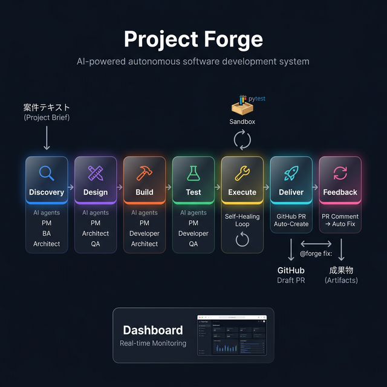

# Project Forge ⚒️

**AI SIベンダーシステム** — 複数のAIエージェントが協働し、案件のライフサイクル全体を自律で遂行するプラットフォーム。

[](https://python.org)
[](LICENSE)

---

## 📖 概要

Project Forge は「Discussion Engine」の**複数ペルソナ × ターンループ**パターンを、ソフトウェア開発ライフサイクル（SDLC）に応用したシステムです。

案件テキスト（`brief`）を入力すると、PM・BA・Architect・Developer・QA の AI エージェントが自律的に議論・合意形成し、要件定義からテストスクリプトまでを一気通貫で生成します。



- **Discovery〜Test（Phase 1-4）**: AI エージェントが自律的に議論・合意してドキュメントを生成
- **Execute（Phase 5）**: 生成されたコードを実際に実行→失敗なら自動修正（セルフヒーリング）
- **Deliver（Phase 6）**: 品質検証済みの成果物を GitHub Draft PR として自動提出
- **Feedback（Phase 7）**: PR コメント `@forge fix:` で AI が自動修正→Push

---

## 🏗️ アーキテクチャ

```
project_forge/
├── lib/                          # コアライブラリ
│   ├── core/                     # コア基盤
│   │   ├── forge_orchestrator.py # メインオーケストレーター（エントリポイント）
│   │   ├── phase_engine.py       # フェーズ進行エンジン
│   │   ├── artifact_manager.py   # 成果物の管理
│   │   ├── role_generator.py     # ペルソナ生成
│   │   └── gemini_client.py      # Gemini APIクライアント
│   ├── execution/                # コード実行・セルフヒーリング
│   │   └── code_executor.py
│   ├── cicd/                     # CI/CD・GitHub連携
│   │   ├── cicd_manager.py       # GitHub PR 自動作成モジュール
│   │   ├── pr_auto_fixer.py      # PR自動修正ロジック
│   │   └── github_cli_wrapper.py # gh CLIラッパー
│   └── web/                      # ダッシュボード・UI
│       └── dashboard_app.py      # FastAPI リアルタイムダッシュボードサーバー
├── templates/
│   ├── roles/                    # ロール別システムプロンプトテンプレート
│   │   ├── pm.md, ba.md, architect.md, developer.md, qa.md
│   └── phases/                   # フェーズ別指示テンプレート
├── frontend/                     # ダッシュボード UI（HTML/CSS/JS）
│   ├── index.html
│   ├── style.css
│   └── app.js
├── tests/                        # 自動テスト
│   ├── test_artifact_manager.py
│   ├── test_phase_engine.py
│   └── test_role_generator.py
└── projects/                     # 実行済みプロジェクトの成果物（自動生成）
    ├── latest_state.json          # ダッシュボード用リアルタイム状態ファイル
    └── YYYYMMDD_HHMMSS_<brief>/  # プロジェクトディレクトリ
        ├── brief.md
        ├── state.json
        ├── FINAL_REPORT.md
        ├── log_<phase>.json
        ├── sandbox/              # Phase 5 で実際にコードを実行する作業領域
        └── artifacts/
            ├── discovery/        requirements.md, risks.md
            ├── design/           architecture.md, test_strategy.md
            ├── build/            source_code.md, implementation_notes.md
            ├── test/             test_scripts.md, test_report.md
            └── execute/          main.py, test_main.py（セルフヒーリング後の最終コード）
```

---

## 🚀 クイックスタート

### 前提条件

- Python 3.10 以上
- `gemini` CLI がインストール済み・認証済み
- （CI/CD機能を使う場合）GitHub Personal Access Token

### インストール

```bash
git clone <このリポジトリのURL>
cd agent-shogun/workspace/project_forge
pip install -r requirements.txt
```

### プロジェクト実行（基本）

```bash
# フェーズ 1-4 のみ（ドキュメント生成）
python -m lib.core.forge_orchestrator "社内ナレッジ共有チャットボットの開発"

# + Phase 5 セルフヒーリング（コードを実際に実行して自動修正）
python -m lib.core.forge_orchestrator "社内チャットボットの開発" --execute

# モックモード（API呼び出しなし・動作確認用）
python -m lib.core.forge_orchestrator "Hello World を出力するスクリプト" --mock --execute
```

### GitHub PR 自動作成付きで実行

```bash
# 環境変数を設定してから実行
export GITHUB_TOKEN="ghp_xxxxxxxxxxxx"
export GITHUB_REPO="your-org/your-repo"

# Phase 1-4 完了 → PR 自動作成
python -m lib.core.forge_orchestrator "社内チャットボットの開発" --pr

# Phase 1-4 → セルフヒーリング → PR 自動作成（フルパイプライン）
python -m lib.core.forge_orchestrator "社内チャットボットの開発" --execute --pr
```

### ダッシュボードの起動

#### 方法A: FastAPI サーバー経由（フル機能・推奨）

```bash
# 別のターミナルでダッシュボードサーバーを起動
uvicorn lib.web.dashboard_app:app --reload --port 8000

# ブラウザで http://localhost:8000 を開く
```

#### 方法B: VS Code Live Server でそのまま開く

1. VS Code で `frontend/index.html` を右クリック → **「Open with Live Server」**
2. ブラウザで開く（`http://127.0.0.1:5500/workspace/project_forge/frontend/index.html`）

> [!NOTE]
> Live Server の場合は `projects/latest_state.json` を直接読み込みます。
> Forge の実行中 (`python -m lib.core.forge_orchestrator "案件" --mock`) にブラウザを開くと
> 2秒ごとに自動更新されてリアルタイムで確認できます。

---

## 🔄 フェーズ詳細

| Phase | 名称 | 参加ロール | 成果物 |
|:-----:|:-----|:----------|:-------|
| 1 | 🔍 Discovery（深掘り） | PM, BA, Architect | `requirements.md`, `risks.md` |
| 2 | 📐 Design（設計） | PM, Architect, QA | `architecture.md`, `test_strategy.md` |
| 3 | ⚒️ Build（実装） | PM, Developer, Architect | `source_code.md`, `implementation_notes.md` |
| 4 | 🧪 Test（テスト） | PM, Developer, QA | `test_scripts.md`, `test_report.md` |
| 5 | 🔧 Execute（実行・自動修正） | CodeExecutor + Developer | `artifacts/execute/main.py`, `escalation_report.md` |
| 6 | 🚀 Deliver（PR自動作成） | CICDManager | GitHub Draft PR |

各フェーズはターンループ（最大12ターン、最低4ターン）で進行し、PM が品質基準を満たしたと判断した時点で `[GATE_PASSED: true]` を宣言して次フェーズへ移行します。

---

## 🔧 Phase 5: セルフヒーリング（自動実行・自動修正）

`code_executor.py` が担当する、生成コードの実際の実行と自動修正ループです。

```
[ Build成果物 source_code.md ] → コード抽出
[ Test成果物 test_scripts.md ] → テストコード抽出
        ↓
  sandbox/ で pytest を実行
        ↓
  ┌─── PASS → artifacts/execute/ に保存 → Phase 6 (PR) へ
  └─── FAIL → Developer エージェントに修正依頼 → 再試行（最大3回）
                         ↓ 3回全て失敗
               escalation_report.md を生成 → 人間にエスカレーション
```

| パラメータ | デフォルト | 説明 |
|:---------|:----------:|:-----|
| 最大リトライ数 | 3回 | `CodeExecutor(max_retries=N)` で変更可 |
| タイムアウト | 30秒 | `CodeExecutor.TIMEOUT_SECONDS` で変更可 |
| サンドボックス | subprocess | 将来的に Docker 対応予定 |

---

## 🤖 CI/CD 連携（GitHub PR 自動作成）

`cicd_manager.py` により、全フェーズ完了後に以下を自動実行します：

1. **専用ブランチ作成**: `feature/forge-YYYYMMDD-<brief-slug>`
2. **成果物を全件コミット・Push**
3. **Draft PR を自動作成**（`ai-generated` ラベル付き）
4. PR 説明文に全フェーズのサマリー + テスト結果を自動記載

詳細は [CONTRIBUTING.md](CONTRIBUTING.md) を参照。

---

## 🔄 Phase 7: PR フィードバックループ（自動修正サイクル）

PR にレビューコメントで `@forge fix: 修正指示` と書くと、AI が自動で修正 → テスト → Push します。

```
人間: "@forge fix: handleError を try/except で囲んで"
  → GitHub Actions が発火
  → コメントを SIMPLE / MODERATE / COMPLEX に自動分類
  → 分類に応じたペルソナが修正（Architect / Developer / QA / PM）
  → pytest でセルフヒーリング → Push → 修正完了コメント投稿
```

| 分類 | 参加ペルソナ | 所要時間 |
|:-----|:-----------|:--------:|
| 🟢 SIMPLE | Developer のみ | ~30秒 |
| 🟡 MODERATE | Architect → Developer → QA | ~2分 |
| 🔴 COMPLEX | Architect → Developer → QA → PM | ~5分 |

---

## 🧪 テスト実行

```bash
# 全テスト実行
pytest tests/ -v

# カバレッジ付き
pytest tests/ -v --cov=lib
```

---

## 🛠️ 環境変数

| 変数名 | 必須 | 説明 |
|:-------|:----:|:-----|
| `GITHUB_TOKEN` | CI/CD時 | GitHub Personal Access Token（`repo` スコープ必要） |
| `GITHUB_REPO` | CI/CD時 | 対象リポジトリ（例: `owner/repo-name`） |
| `GEMINI_API_KEY` | API使用時 | Gemini API キー |

---

## 📄 ライセンス

MIT License — 詳細は [LICENSE](LICENSE) を参照。
